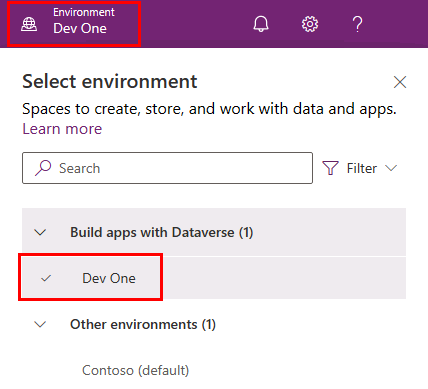
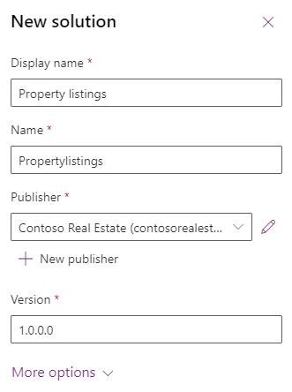

---
lab:
  title: 'Laboratório 1: Publicador e solução'
  module: 'Module 1: Create tables in Dataverse'
---

# Laboratório de Prática 1 – Publicador e solução

## Cenário

Neste laboratório, você criará um publicador e uma solução.

## O que você aprenderá

- Como criar uma solução no Microsoft Dataverse
- Como adicionar componentes existentes a uma solução

## Macroetapas do laboratório

- Criar editor
- Criar solução do 
- Adicionar tabela, coluna, exibição e formulário à solução
  
## Pré-requisitos

- Precisa ter concluído o **Laboratório 0: Validar o ambiente de laboratório**

## Etapas detalhadas

## Exercício 1 – Criar publicador e solução

Neste exercício, você acessará o portal do criador do Power Apps e o ambiente do Desenvolvedor e criará uma nova solução.

### Tarefa 1.1 – Portal do criador

1. Em uma nova guia, navegue até o portal do criador do Power Apps `https://make.powerapps.com` e entre com suas credenciais do Microsoft 365, se solicitado novamente.

1. Se for solicitado que você informe um **número de telefone**, insira `0123456789` e selecione **Enviar**.

1. Alterne ambientes usando o Seletor de ambiente no canto superior direito da tela.

1. Selecione o ambiente **Dev One** na lista.

    

1. Selecione **Aplicativos** no painel de navegação esquerdo e selecione **Tudo**. Você deverá ver vários aplicativos, incluindo o aplicativo acelerador do Dataverse, o Hub de Integridade da Solução e o Gerenciamento do Power Pages, listados.

1. Selecione **Tabelas** no painel de navegação esquerdo. Você deverá ver as tabelas padrão do *Common Data Model*, incluindo Conta e Contato.

### Tarefa 1.2 – Criar solução e publicador

1. Selecione **Soluções** no painel de navegação esquerdo. Você deverá ver várias soluções, incluindo a *Solução padrão* e a *Solução padrão do Common Data Services*.

    

1. Selecione **+ Nova solução**.

1. Na caixa de texto **Nome de exibição**, insira **`Property listings`**

1. Verifique se o **Nome** é preenchido automaticamente.

1. Selecione **+ Novo publicador** abaixo da lista suspensa do **Publicador**.

1. Para **Nome de exibição**, insira `Contoso Real Estate`

1. Em **Nome**, insira `contosorealestate`

1. Em **Prefixo**, insira `cre`

    

1. Selecione **Salvar**.

1. Na lista suspensa **Publicador**, selecione **Contoso Real Estate (contosorealestate)**.

1. Selecione **Criar**.

    

## Exercício 2 – Adicionar componentes à solução

Neste exercício, você adicionará uma tabela existente à solução.

### Tarefa 2.1 – Adicionar tabela

1. Navegue até o portal do Power Apps Maker `https://make.powerapps.com`

1. Verifique se você está no ambiente **Dev One**.

1. Selecione **Soluções**.

1. Selecione a solução **Contoso Real Estate**, do exercício anterior.

    

1. Selecione **Adicionar existente** e escolha **Tabela**.

    

1. Selecione a tabela **Conta**.

    

1. Selecione **Avançar**.

1. Na tabela **Conta**, selecione o link **Selecionar objetos**.

1. Na guia **Colunas**, selecione a coluna **Número da conta**.

1. Selecione a guia **Exibições**.

1. Selecione a exibição **Contas Ativas**.

1. Selecione a guia **Formulários**.

1. Selecione o formulário **Conta**.

1. Selecione **Adicionar**.

    > **Observação:** Você deverá ter selecionado 1 modo de exibição, 1 formulário e 1 coluna para a tabela **Conta**.

    

1. Selecione **Adicionar**.
