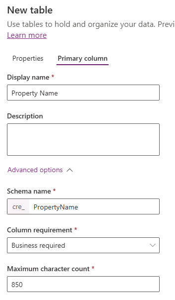
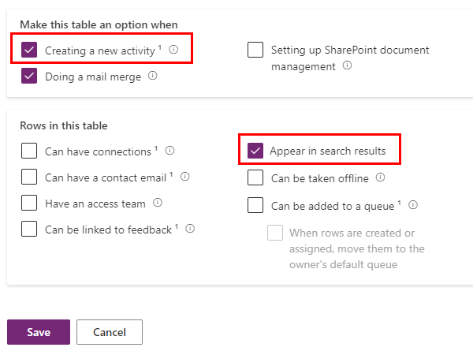

---
lab:
  title: 'Laboratório 2: Modelo de dados'
  module: 'Module 1: Create tables in Dataverse'
---

# Laboratório de prática 2 – Modelo de dados

## Cenário

Nesse laboratório, você criará tabelas, colunas e relações do Dataverse.

A Contoso Real Estate deseja acompanhar dois elementos-chave:

- Listagens de propriedades imobiliárias
- Quem está agendado para mostrar os imóveis

## O que você aprenderá

- Como criar tabelas no Dataverse
- Como adicionar colunas a tabelas do Dataverse
- Como criar relações entre tabelas

## Macroetapas do laboratório

- Criar tabelas
- Criar colunas
- Criar relações
  
## Pré-requisitos

- É necessário ter concluído o **Laboratório 1: Publicador e solução**

## Etapas detalhadas

## Exercício 1 – Criar tabelas

Nesse exercício, você criará e adicionará tabelas à solução.

### Tarefa 1.1 – Criar tabela Propriedade Imobiliária

1. Navegue até o portal do Power Apps Maker `https://make.powerapps.com`

1. Verifique se você está no ambiente **Dev One**.

1. Selecione **Soluções**.

1. Abra a solução **Listagens de propriedades**.

1. Selecione **+ Novo** e, em seguida, selecione **Tabela** e selecione **Tabela (propriedades avançadas)**.

    

1. Para **Nome de exibição**, insira `Real Estate Property`. O nome plural será preenchido automaticamente.

1. Selecione a guia **Coluna primária**.

1. Para **Nome de exibição**, insira `Property Name`.

1. Expanda **Opções avançadas**, examine as opções disponíveis, mas não altere nada aqui.

    

1. Clique na guia **Propriedades**.

1. Expanda **Opções avançadas**.

1. Verifique **Criar uma nova atividade**.

1. Verificar **Aparecer nos resultados da pesquisa**.

    

1. Selecione **Salvar**.

### Tarefa 1.2 – Criar tabela de Visitação

1. No painel **Objetos**, selecione **Tudo**.

1. Selecione **+ Novo** e, em seguida, selecione **Tabela** e selecione **Tabela (propriedades avançadas)**.

1. Para **Nome de exibição**, insira `Showing`. O nome plural será preenchido automaticamente.

1. Expanda **Opções avançadas**.

1. Verificar **Aparecer nos resultados da pesquisa**.

1. Selecione **Salvar**.

### Tarefa 1.3 – Criar tabela de Evento de visitação aberta

1. No painel **Objetos**, selecione **Tudo**.

1. Selecione **+ Novo** e, em seguida, selecione **Tabela** e **Tabela (propriedades avançadas)** novamente.

1. Para **Nome de exibição**, insira `Open House`. O nome plural será preenchido automaticamente.

1. Expanda **Opções avançadas**.

1. Selecione **Organização** para **Propriedade do registro**.

1. Selecione **Salvar**.

### Tarefa 1.4 – Adicionar tabela de contatos

1. No painel **Objetos**, selecione **Tudo**.

1. Selecione **Adicionar existente** e escolha **Tabela**.

1. Selecione a tabela **Contato**.

1. Selecione **Avançar**.

1. Selecione **Adicionar**.

## Exercício 2 – Criar colunas

Nesse exercício, você criará colunas para as tabelas da solução.

### Tarefa 2.1 – Criar colunas de Propriedade Imobiliária

1. Navegue até o portal do Power Apps Maker `https://make.powerapps.com`

1. Verifique se você está no ambiente **Dev One**.

1. Selecione **Soluções**.

1. Abra a solução **Listagens de propriedades**.

1. Selecione a tabela **Propriedade imobiliária**.

1. Selecione **Propriedades**.

    

1. Verifique **Habilitar anexos** e selecione **Salvar**.

1. Em **Esquema**, selecione **Colunas**.

1. Selecione **+ Nova coluna**.

    

1. Para **Nome de exibição**, insira `Asking Price`.

1. Selecione **Moeda** na lista suspensa **Tipo de dados**.

1. Na lista suspensa **Obrigatório**, selecione **Empresa necessária**.

1. Selecione **Salvar**.

1. Selecione **+ Nova coluna**.

1. Para **Nome de exibição**, insira `Street`.

1. Na lista suspensa **Obrigatório**, selecione **Empresa necessária**.

1. Selecione **Salvar**.

1. Selecione **+ Nova coluna**.

1. Para **Nome de exibição**, insira `City`.

1. Na lista suspensa **Obrigatório**, selecione **Empresa necessária**.

1. Selecione **Salvar**.

1. Selecione **+ Nova coluna**.

1. Para **Nome de exibição**, insira `Bedrooms`.

1. Selecione **Opção** na lista suspensa **Tipo de dados** e selecione **Opção** novamente.

    

1. Selecione **Sim** para **Sincronizar com a opção global**.

1. Selecione **+ Nova opção**.

    

1. Para **Nome de exibição**, insira `Number of Rooms`.

1. Insira `1` para **Rótulo** e `1` para **Valor**.

1. Selecione **+ Nova opção** e insira `2` para **Rótulo** e `2` para **Valor**.

1. Selecione **+ Nova opção** e insira `3` para **Rótulo** e `3` para **Valor**.

1. Selecione **+ Nova opção** e insira `4` para **Rótulo** e `4` para **Valor**.

1. Selecione **+ Nova opção** e insira `5` para **Rótulo** e `5` para **Valor**.

    

1. Selecione **Salvar**.

1. Em **Sincronizar esta opção com** selecione **Número de salas**.

1. Selecione **Salvar**.

1. Selecione **+ Nova coluna**.

1. Para **Nome de exibição**, insira `Bathrooms`.

1. Selecione **Opção** na lista suspensa **Tipo de dados** e selecione **Opção** novamente.

1. Em **Sincronizar esta opção com** selecione **Número de salas**.

1. Selecione **Salvar**.

### Tarefa 2.2 – Criar colunas de Visitação

1. No painel **Objetos**, selecione **Tudo**.

1. Selecione a tabela **Visitação**.

1. Em **Esquema**, selecione **Colunas**.

1. Selecione **+ Nova coluna**.

1. Para **Nome de exibição**, insira `Showing Date`.

1. Selecione **Data e hora** na lista suspensa **Tipo de dados**.

1. Selecione **Data somente** na lista suspensa **Formato**.

1. Na lista suspensa **Obrigatório**, selecione **Empresa necessária**.

1. Selecione **Salvar**.

1. Selecione **+ Nova coluna**.

1. Para **Nome de exibição**, insira `Comments`.

1. Selecione **Texto** na lista suspensa **Tipo de dados** e, em seguida, em **Várias linhas de texto**, selecione **Texto sem formatação**.

1. Selecione **Salvar**.

1. Selecione **+ Nova coluna**.

1. Para **Nome de exibição**, insira `Level of Interest`.

1. Selecione **Opção** na lista suspensa **Tipo de dados** e selecione **Opção** novamente.

1. Selecione **Não** para **Sincronizar com a opção global**.

1. Insira `Very High` para **Rótulo**.

1. Selecione **+ Nova opção** e insira `High` para **Rótulo**.

1. Selecione **+ Nova opção** e insira `Medium` para **Rótulo**.

1. Selecione **+ Nova opção** e insira `Low` para **Rótulo**.

1. Selecione **+ Nova opção** e insira `No interest` para **Rótulo**.

1. Selecione **Salvar**.

1. Selecione **+ Nova coluna**.

1. Para **Nome de exibição**, insira `Shown by`.

1. Selecione **Pesquisa** na lista suspensa **Tipo de dados** e selecione **Pesquisa** novamente.

1. Na lista suspensa **Tabela relacionada**, selecione **Usuário**.

1. Selecione **Salvar**.

### Tarefa 2.3 – Criar colunas de Evento de visitação aberta

1. No painel **Objetos**, selecione **Tudo**.

1. Selecione a tabela **Evento de visitação aberta**.

1. Em **Esquema**, selecione **Colunas**.

1. Selecione **+ Nova coluna**.

1. Para **Nome de exibição**, insira `Open House Date`.

1. Selecione **Data e hora** na lista suspensa **Tipo de dados**.

1. Selecione **Data somente** na lista suspensa **Formato**.

1. Na lista suspensa **Obrigatório**, selecione **Empresa necessária**.

1. Selecione **Salvar**.

## Exercício 3 – Criar relações

Neste exercício, você criará relações entre as tabelas para a solução.

### Tarefa 3.1 – Relação entre Propriedade imobiliária e Contato

1. Navegue até o portal do Power Apps Maker `https://make.powerapps.com`

1. Verifique se você está no ambiente **Dev One**.

1. Selecione **Soluções**.

1. Abra a solução **Listagens de propriedades**.

1. Selecione a tabela **Propriedade imobiliária**.

1. Em **Esquema**, selecione **Relações**.

1. Selecione **+ Novo relacionamento** e selecione **Muitos para um**.

1. Na lista suspensa **Tabela relacionada (uma)**, selecione **Contato**.

1. Insira `Client` para o **Nome de exibição da coluna Pesquisa**.

1. Na lista suspensa **Requisito da coluna de pesquisa**, selecione**Empresa necessária**.

1. Selecione **Concluído**.

### Tarefa 3.2 – Relação entre Propriedade imobiliária e Visitação

1. Selecione **+ Novo relacionamento** e selecione **Um para muitos**.

1. Na lista suspensa **Tabela relacionados (muitos)**, selecione **Visitação**.

1. Na lista suspensa **Requisito da coluna de pesquisa**, selecione**Empresa necessária**.

1. Selecione **Concluído**.

### Tarefa 3.3 – Relação entre Propriedade imobiliária e Evento de visitação aberta

1. Selecione **+ Novo relacionamento** e selecione **Um para muitos**.

1. Na lista suspensa **Tabela relacionados (muitos)**, selecione **Evento de visitação aberta**.

1. Na lista suspensa **Requisito da coluna de pesquisa**, selecione**Empresa necessária**.

1. Expanda **Geral**.

1. Insira `realestateproperty_openhouse` em **Nome da relação**.

1. Selecione **Concluído**.

### Tarefa 3.4 – Relação entre Visitação e Contato

1. No painel **Objetos**, selecione **Tudo**.

1. Selecione a tabela **Visitação**.

1. Em **Esquema**, selecione **Relações**.

1. Selecione **+ Novo relacionamento** e selecione **Muitos para um**.

1. Na lista suspensa **Tabela relacionada (uma)**, selecione **Contato**.

1. Insira `Shown to` para o **Nome de exibição da coluna Pesquisa**.

1. Selecione **Concluído**.

