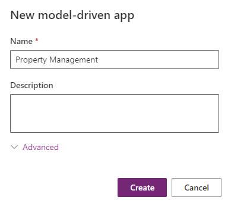
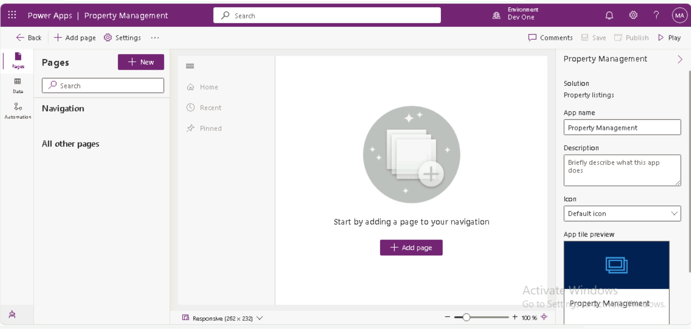
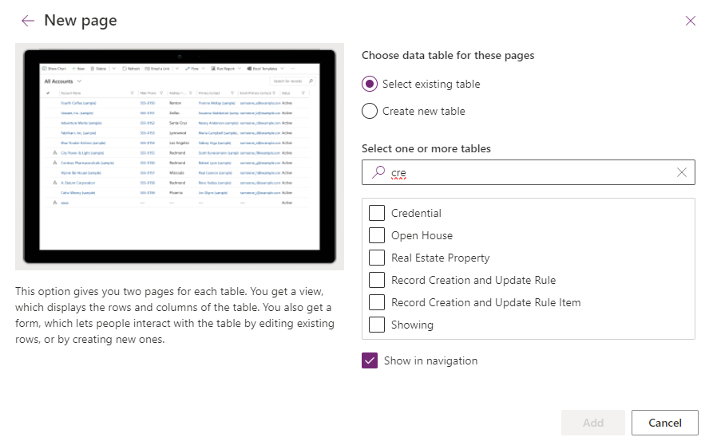
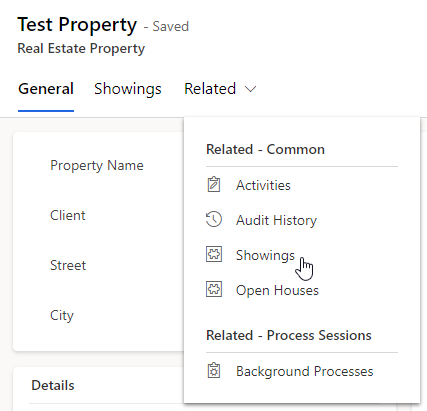

---
lab:
  title: 'Laboratório 3: Criar um aplicativo baseado em modelo'
  module: 'Module 2: Get started with model-driven apps in Power Apps'
---

# Laboratório prático 3: criar um aplicativo controlado por modelos

## Cenário

Neste laboratório, você criará um aplicativo controlado por modelos e adicionará tabelas ao aplicativo.

A Contoso Real Estate deseja acompanhar dois elementos-chave:

- Listagens de propriedades imobiliárias
- Quem está agendado para mostrar os imóveis

## O que você aprenderá

- Como criar um aplicativo controlado por modelos
- Como adicionar tabelas ao aplicativo

## Macroetapas do laboratório

- Criar um aplicativo baseado em modelo
- Adicionar tabelas ao aplicativo
  
## Pré-requisitos

- É necessário ter concluído **Laboratório 2: Modelo de dados**

## Etapas detalhadas

## Exercício 1: criar um aplicativo controlado por modelos

Neste exercício, você criará um aplicativo controlado por modelos.

### Tarefa 1.1: criar aplicativo de Gerenciamento de Propriedades

1. Navegue até o portal do Power Apps Maker `https://make.powerapps.com`

1. Verifique se você está no ambiente **Dev One**.

1. Selecione **Soluções**.

1. Abra a solução **Listagens de propriedades**.

1. Selecione **+ Novo** e, em seguida, selecione **Aplicativo** e **Aplicativo controlado por modelo**.

    

1. Insira `Property Management` para **Nome**.

1. Selecione **Criar**.

    

### Tarefa 1.2: adicionar tabelas

1. Selecione a lista suspensa ao lado de **+ Adicionar página** e selecione a **tabela Dataverse**.

    

1. Insira `cre_` em **Pesquisar**.

    

1. Selecionar **Abrir Casa**, **Propriedades Imobiliárias** e **Mostrar**.

1. Insira `account` em **Pesquisar** e selecione **Conta**.

1. Insira `contact` em **Pesquisar** e selecione **Contato**.

1. Selecione **Adicionar**.

    

1. Selecione **Salvar e Publicar**.

    

### Tarefa 1.3: testar

1. Com o designer de aplicativos **Gerenciamento de Propriedades** aberto, selecione o botão **Executar**.

1. Navegue até **Contatos**.

1. Selecione **+ Novo**.

1. Insira `Jon` para **Primeiro Nome**.

1. Insira `Doe` para **Último Nome**

1. Selecione **Salvar e Fechar**.

1. Navegue até **Propriedades Imobiliárias**

1. Selecione **+ Novo**.

1. Insira `Test Property` para **Nome da Propriedade**.

1. Selecione **Salvar**.

1. Selecione **Relacionados** e **Exibições**.

    

1. Selecione **+ Nova Exibição**.

1. Insira `First Showing` para **Nome**.

1. Selecione **Salvar e Fechar**.

1. Selecione **Salvar e Fechar**.

1. Feche o aplicativo.

1. Selecione **<- Voltar** no designer do aplicativo **Gerenciamento de Propriedades**.
