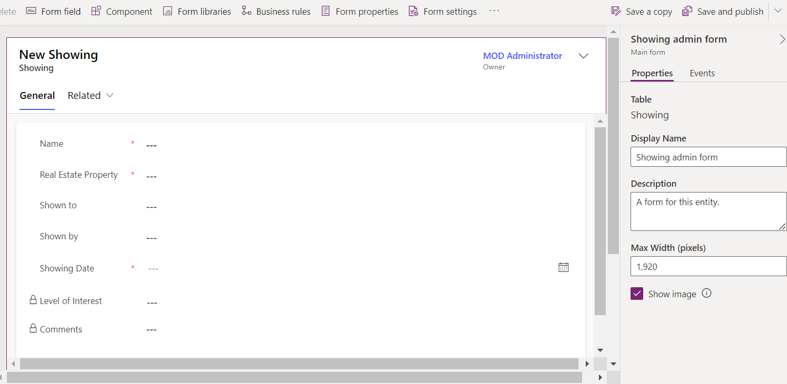
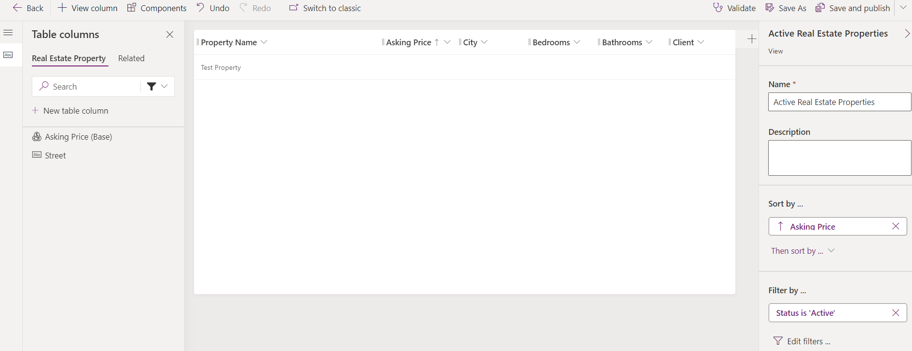

---
lab:
  title: '‘Laboratório 4: Configurar formulários e exibições'
  module: 'Module 3: Configure forms, charts, and dashboards in model-driven apps'
---

# Laboratório de Prática 4 – Configurar formulários e exibições

## Cenário

Neste laboratório, você configurará formulários e exibições para um aplicativo controlado por modelos.

A Contoso Real Estate deseja acompanhar dois elementos-chave:

- Listagens de propriedades imobiliárias
- Quem está agendado para mostrar os imóveis

## O que você aprenderá

- Como configurar formulários de tabela
- Como configurar exibições de tabela

## Macroetapas do laboratório

- Configurar o formulário principal de Propriedade imobiliária e Visitação
- Configurar guias e seções
- Adicionar colunas aos formulários
- Adicionar uma subgrade
- Criar um novo formulário
- Associar funções de segurança a formulários
- Configurar os modos de exibição de Propriedade imobiliária e Visitação
- Filtrar modos de exibição
- Configurar o modo de exibição de Busca rápida
  
## Pré-requisitos

- É necessário ter concluído **Laboratório 2: Modelo de dados**

## Etapas detalhadas

## Exercício 1 – Formulário principal da Propriedade imobiliária

Neste exercício, você modificará o formulário principal da tabela Propriedade imobiliária.

### Tarefa 1.1 – Layout de formulário principal e colunas

1. Navegue até o portal do Power Apps Maker `https://make.powerapps.com`

1. Verifique se você está no ambiente **Dev One**.

1. Selecione **Soluções**.

1. Abra a solução **Listagens de propriedades**.

1. Selecione a tabela **Propriedade imobiliária**.

1. Em **Experiências com dados**, selecione **Formulários**.

1. Selecione o formulário **Informações** em que o **Tipo de formulário** é **Principal**, selecione o menu **Comandos** (...) e selecione **Editar** > **Editar na nova guia**.

1. Selecione o **Modo de exibição de árvore** no lado esquerdo do designer de formulários.

1. Selecione a guia **Geral**.

1. Insira `generalTab` para **Nome**.

1. No painel **Propriedades** no lado direito, selecione **3 colunas** na lista suspensa **Layout**.

    

1. No **Modo de exibição de árvore**, expanda a guia **Geral**. Selecione a primeira seção e insira `generalSection` o **nome**.

1. Selecione a segunda seção e insira `Timeline` para **Rótulo** e `timelineSection` para **Nome**.

1. Selecione a terceira seção e insira `Related` para **Rótulo** e `relatedSection` para **Nome**.

1. Arraste o campo **Proprietário** para a área **Cabeçalho**.

    

1. Selecione a primeira seção.

1. Selecione **Colunas da tabela** da navegação à esquerda no designer de formulários.

1. Arraste a coluna **Cliente** abaixo do campo **Nome da propriedade**.

1. Selecione a coluna **Rua** a ser adicionada ao formulário abaixo de **Cliente**.

1. Selecione a coluna **Cidade** a ser adicionada ao formulário abaixo de **Rua**.

1. Selecione **Componentes** na navegação à esquerda no designer de formulários.

1. Selecione o controle de **seção de 1 coluna** para adicioná-lo ao formulário.

1. Insira `Details` para **Rótulo** e `detailsSection` para **Nome**.

1. Selecione **Colunas da tabela** da navegação à esquerda no designer de formulários.

1. Selecione a coluna **Valor pretendido** para adicionar à seção Detalhes.

1. Selecione a coluna **Moeda** para adicionar ao formulário abaixo de **Valor pretendido**.

1. Selecione a coluna **Quartos** para adicionar ao formulário abaixo de **Moeda**.

1. Selecione a coluna **Banheiros** para adicionar ao formulário abaixo de **Quartos**.

    

### Tarefa 1.2 – Adicionar controle de linha do tempo

1. Selecione o **modo de exibição de árvore** na navegação à esquerda no designer de formulários.

1. Selecione a seção **Linha do tempo**.

1. Selecione **Componentes** na navegação à esquerda no designer de formulários.

1. Expanda **Exibição**.

1. Selecione o controle **Linha do tempo** para adicioná-lo à seção **Linha do tempo**.

1. Selecione o **modo de exibição de árvore** na navegação à esquerda no designer de formulários, expanda a guia **Geral** e selecione a seção **Linha do tempo**.

1. No painel **Propriedades** no lado direito, marque a caixa **Ocultar rótulo**.

    

1. No **modo de exibição de árvore**, selecione o controle **Texto da observação** para a linha do tempo.

1. No painel **Propriedades** à direita, selecione **Atividade social**, desmarque a caixa **Habilitar** e selecione **Concluído**.

1. No painel **Propriedades** no lado direito, selecione **Data de criação** no menu suspenso **Classificar as atividades por**.

1. Selecione **Colunas da tabela** da navegação à esquerda no designer de formulários.

1. Arraste a coluna **Motivo do status** para a área **Cabeçalho**.

### Tarefa 1.3 – Adicionar controle modo de exibição rápida

1. Selecione o **Modo de exibição de árvore** no lado esquerdo do designer de formulários.

1. Selecione a seção **Relacionado**.

1. Selecione **Componentes** na navegação à esquerda do designer de formulários.

1. Expanda **Exibição**.

1. Selecione o controle **Exibição rápida** para adicioná-la à seção **Relacionado**.

1. Selecione **Cliente** para **Pesquisa** e **cartão de visita da conta** para **Contato** e selecione **Concluído**.

### Tarefa 1.4 – Adicionar guia

1. Selecione **Componentes** na navegação à esquerda do designer de formulários.

1. Selecione o controle de **guia de 1 coluna** para adicioná-lo ao formulário.

1. Insira `Showings` para **Rótulo** e `showingTab` para **Rótulo**.

1. Selecione o **Modo de exibição de árvore** no lado esquerdo do designer de formulários, expanda a guia **Visitações** e selecione a seção **Nova seção**.

1. Insira `Showings` para **Rótulo** e `showingSection` para **Nome**.

1. Selecione **Componentes** na navegação à esquerda do designer de formulários.

1. Expanda **Grade**.

1. Selecione o controle **Subgrade** para adicioná-lo à seção **Visitações**.

1. Selecione **Mostrar os registros relacionados**.

1. Selecione **Visitações** para **Tabela** e **Visitações ativas** para **Modo de exibição padrão** e selecione **Concluído**.

1. Insira `Showings` para **Rótulo** e `showingsSG` para **Nome**.

1. Selecione **Ocultar rótulo**.

1. Selecione **Salvar e Publicar**.

1. **Feche** o designer de formulários.

1. Selecione **Concluído**.

## Exercício 2 – Formulário principal de visitação

Neste exercício, você modificará o formulário principal da tabela Visitação.

### Tarefa 2.1 – Layout de formulário principal e colunas

1. Navegue até o portal do Power Apps Maker `https://make.powerapps.com`

1. Verifique se você está no ambiente **Dev One**.

1. Selecione **Soluções**.

1. Abra a solução **Listagens de propriedades**.

1. Selecione a tabela **Visitação**.

1. Em **Experiências com dados**, selecione **Formulários**.

1. Selecione o formulário **Informações** em que o **Tipo de formulário** é **Principal**, selecione o menu **Comandos** (...) e selecione **Editar** > **Editar na nova guia**.

1. Arraste o campo **Proprietário** para a área **Cabeçalho**.

1. Selecione **Colunas da tabela** da navegação à esquerda no designer de formulários.

1. Arraste a coluna **Propriedade imobiliária** para baixo do campo **Nome**.

1. Selecione a coluna **Mostrado para** para adicionar ao formulário abaixo de **Propriedade imobiliária**.

1. Selecione a coluna **Mostrado por** para adicionar ao formulário abaixo de **Mostrado para**.

1. Selecione a coluna **Data da visitação** para adicionar ao formulário abaixo de **Mostrado por**.

1. Selecione a coluna **Nível de interesse** a ser adicionada ao formulário abaixo da **Data de visitação**.

1. Selecione a coluna **Comentários** a ser adicionada ao formulário abaixo de **Nível de interesse**.

1. No painel **Propriedades** no lado direito, aumente a **Altura do campo formulário** para **3 linhas**.

1. Selecione **Salvar e Publicar**.

1. **Feche** o designer de formulários.

1. Selecione **Concluído**.

## Exercício 3 – Vários formulários

Neste exercício, você criará um novo formulário e restringirá o acesso com uma função de segurança.

### Tarefa 3.1 – Função de segurança

1. Navegue até o portal do Power Apps Maker `https://make.powerapps.com`

1. Verifique se você está no ambiente **Dev One**.

1. Selecione **Soluções**.

1. Abra a solução **Listagens de propriedades**.

1. Selecione **+ Novo**, selecione **Segurança** e selecione **Função de segurança**.

1. Insira `Property admin` para o **Nome da função**.

1. Selecione a guia **Entidades Personalizadas**.

1. Selecione a tabela **Propriedade imobiliária** 4 vezes para alterar o nível de acesso em todos os privilégios para **Organização**.

    

1. Selecione a tabela **Visitação** 4 vezes para alterar o nível de acesso em todos os privilégios para a **Organização**.

1. Selecione **Salvar e Fechar**.

1. Selecione **Concluído**.

### Tarefa 3.2 – Copiar formulário

1. Selecione a tabela **Visitação**.

1. Em **Experiências com dados**, selecione **Formulários**.

1. Selecione o formulário **Informações** em que o **Tipo de formulário** é **Principal**, selecione o menu **Comandos** (...) e selecione **Editar** > **Editar na nova guia**.

1. Selecione **Nível de Interesse** e, no painel Propriedades, selecione **Somente leitura**.

1. Selecione **Comentários** e, no painel Propriedades, selecione **Somente leitura**.

1. Selecione **Salvar uma cópia**.

1. Insira `Showing admin form` para o **Nome de exibição** e selecione **Salvar**.

    

1. Selecione **Configurações de formulário**.

1. Selecione a função de segurança de **Administrador de propriedade**.

    

1. Selecione **Salvar e Publicar**.

1. **Feche** o designer de formulários.

1. Selecione **Concluído**.

## Exercício 4 – Exibições da Propriedade Imobiliária

Neste exercício, você modificará as exibições da tabela Propriedade Imobiliária.

### Tarefa 4.1 – Exibição pública da propriedade imobiliária

1. Navegue até o portal do Power Apps Maker `https://make.powerapps.com`

1. Verifique se você está no ambiente **Dev One**.

1. Selecione **Soluções**.

1. Abra a solução **Listagens de propriedades**.

1. Selecione a tabela **Propriedade imobiliária**.

1. Em **Experiências com dados**, selecione **Exibições**.

1. Selecione o modo de exibição **Propriedades de imóveis ativos**, selecione o menu **Comandos** (...) e selecione **Editar** > **Editar em uma nova guia**.

1. Selecione o acento circunflexo ao lado da coluna **Criado em** e selecione **Remover**.

1. Selecione a coluna **Valor pretendido** para adicionar ao modo de exibição.

1. Selecione a coluna **Cidade** a ser adicionada ao modo de exibição.

1. Selecione a coluna **Quartos** a ser adicionada ao modo de exibição.

1. Selecione a coluna **Banheiros** a ser adicionada ao modo de exibição.

1. Selecione a coluna **Cliente** a ser adicionada ao modo de exibição.

1. No painel Propriedades, remova o **Nome da propriedade** em **Classificar por**.

1. No painel Propriedades, selecione **Classificar por** e selecione **Valor pretendido**.

    

1. Selecione **Salvar e Publicar**.

1. **Fechar** o designer da exibição.

1. Selecione **Concluído**.

### Tarefa 4.2 – Modo de exibição de Busca rápida da Propriedade imobiliária

1. Selecione a exibição **Localizar Rapidamente Propriedades Imobiliárias Ativas**, selecione o menu **Comandos** (...) e selecione **Editar** > **Editar em uma nova guia**.

1. Selecione o acento circunflexo ao lado da coluna **Criado em** e selecione **Remover**.

1. No painel **Localizar Rapidamente Propriedades Imobiliárias Ativas** à direita, selecione **Editar colunas da tabela de localização** em **Localizar por**.

1. Escolha as colunas a seguir e selecione **Aplicar**.

    - City
    - Cliente
    - Nome da propriedade

1. Selecione **Salvar e Publicar**.

1. **Fechar** o designer da exibição.

1. Selecione **Concluído**.

## Exercício 5 – modos de exibição de Visitação

Neste exercício, você modificará os modos de exibição da tabela Visitação.

### Tarefa 5.1 – Modo de exibição público de Visitação

1. Navegue até o portal do Power Apps Maker `https://make.powerapps.com`

1. Verifique se você está no ambiente **Dev One**.

1. Selecione **Soluções**.

1. Abra a solução **Listagens de propriedades**.

1. Selecione a tabela **Visitação**.

1. Em **Experiências com dados**, selecione **Exibições**.

1. Selecione o modo de exibição **Visitações ativas**, selecione o menu **Comandos** (...) e selecione **Editar** > **Editar em uma nova guia**.

1. Selecione o acento circunflexo ao lado da coluna **Criado em** e selecione **Remover**.

1. Selecione a coluna **Propriedade imobiliária** a ser adicionada ao modo de exibição.

1. Selecione a coluna **Data de visitação** para adicionar ao modo de exibição.

1. Selecione a coluna **Mostrado para** para adicionar ao modo de exibição.

1. Selecione a coluna **Nível de interesse** a ser adicionada ao modo de exibição.

1. Selecione a guia **Relacionado**.

1. Expanda **Propriedade imobiliária**.

1. Selecione a coluna **Valor pretendido** para adicionar ao modo de exibição.

1. No painel Propriedades, remova o **Nome** em **Classificar por**.

1. No painel Propriedades, selecione **Classificar por** e selecione **Data da visitação**.

1. No menu suspenso **Salvar e publicar**, selecione **Somente salvar**.

### Tarefa 5.2 – Novo modo de exibição de Visitação

1. Selecione **Salvar como**.

1. Insira `High Interest showings` para **Nome**.

1. Selecione **Salvar**.

1. Selecione o cursor ao lado da coluna **Nível de interesse** e selecione **Filtrar por**.

1. Selecione **Igual a** e escolha **Muito alto** e **Alto**.

1. Escolha **Aplicar**.

1. Selecione **Salvar e Publicar**.

1. **Fechar** o designer da exibição.

1. Selecione **Concluído**.
