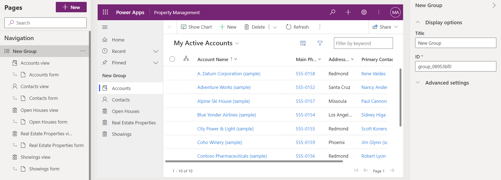

---
lab:
  title: 'Laboratório 5: Configurar um aplicativo orientados por modelo'
  module: 'Module 3: Configure forms, charts, and dashboards in model-driven apps'
---

# Laboratório de Prática 5 – Configurar um aplicativo controlado por modelos

## Cenário

Neste laboratório, você configurará um aplicativo controlado por modelos.

## O que você aprenderá

- Como configurar a navegação para um aplicativo controlado por modelos
- Como restringir exibições em um aplicativo controlado por modelos

## Macroetapas do laboratório

- Adicionar grupos à navegação
- Mover tabelas na navegação
- Restringir exibições no aplicativo
  
## Pré-requisitos

- Deve ter concluído o **Laboratório 2: Modelo de dados**, **Laboratório 3: Criar um aplicativo baseado em modelo** e **Laboratório 4: Configurar formulários e exibições**

## Etapas detalhadas

## Exercício 1 – Configurar o aplicativo baseado em modelo

Neste exercício, você configurará a navegação e tabelas de um aplicativo baseado em modelo.

### Tarefa 1.1 – Configurar grupos

1. Navegue até o portal do Power Apps Maker <https://make.powerapps.com>.

1. Certifique-se de que você esteja no ambiente **Dev One**.

1. Selecione **Soluções**.

1. Abra a solução **Listagens de propriedades**.

1. No painel **Objetos** à esquerda, selecione **Aplicativos**.

1. Selecione o aplicativo **Gerenciamento de propriedades**, selecione o menu **Comandos** (...) e selecione **Editar** > **Editar em uma nova guia**.

1. Selecione **Novo grupo** no painel **Navegação**.

    

1. No painel de propriedades, insira `Clients` para **Título**.

1. Selecione **Navegação**, selecione o menu **Comandos** (...) **...** e selecione **Novo grupo**.

1. No painel de propriedades, insira `Properties` para **Título**.

1. No **Painel de navegação**, selecione **Modo de exibição de visitação**, selecione o menu **Comandos** (...) e selecione **Mover para baixo**.

1. No **Painel de navegação**, selecione o **Modo de exibição de propriedades de imóveis**, selecione o menu **Comandos** (...) e selecione **Mover para baixo**.

1. No **Painel de navegação**, selecione **Modo de exibição de evento de visitação aberta**, selecione o menu **Comandos ** (...) e selecione **Mover para baixo** três vezes.

    

### Tarefa 1.2 – Restringir exibições

1. No **Painel de navegação**, selecione **Modo de exibição de visitações**.

1. No painel **Exibições**, selecione a guia **Exibições**.

1. Selecione o modo de exibição **Modo de exibição de visitações inativas**, no painel direito, selecione o menu **Comandos** (...) e selecione **Remover**.

    

1. Selecione **Salvar**.

1. Selecione **Publicar**.

1. **Feche** o designer de aplicativos e selecione **Concluído**.

