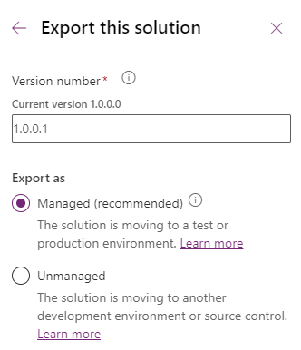

---
lab:
  title: 'Laboratório 6: Exportar solução'
  module: 'Module 4: Manage solutions in Power Apps and Power Automate'
---

# Laboratório de Prática 6 – Exportar solução

## Cenário

Neste laboratório, você exportará a solução

## O que você aprenderá

- Como exportar uma solução do Microsoft Dataverse

## Macroetapas do laboratório

- Publicar personalizações
- Executar o verificador de solução
- Exportar solução
  
## Pré-requisitos

- Precisa ter concluído o **Laboratório 5: Configurar o aplicativo controlado por modelos**

## Etapas detalhadas

## Exercício 1 – Exportar solução

Neste exercício, você exportará a solução do ambiente de desenvolvimento.

### Tarefa 1.1 – Publicar alterações

1. Navegue até o portal do Power Apps Maker `https://make.powerapps.com`

1. Verifique se você está no ambiente **Dev One**.

1. Selecione **Soluções**.

1. Selecione a solução **Listagens de propriedades**.

1. Na solução, selecione a guia **Visão geral**.

    

1. Selecione **Publicar Todas as Personalizações**.

### Tarefa 1.2 – Verificador de solução

1. Na solução, selecione a guia **Visão geral**.

1. Selecione **Executar verificação** sob **Visão geral do status da solução**.

1. Aguarde alguns minutos para que o verificador de solução seja concluído.

    

1. Você não deve ver avisos ou erros.

### Tarefa 1.3 – Exportar solução gerenciada

1. Selecione **Exportar**.

1. Selecione **Avançar**.

1. Selecione **Avançar** novamente.

1. O número de versão deve ter sido incrementado para **1.0.0.1**.

    

1. Selecione **Gerenciada** para **Exportar como**.

1. Selecione **Exportar**.

1. A exportação será preparada em segundo plano. Quando a solução estiver pronta, selecione o botão **Download**.

### Tarefa 1.4 – Exportar solução não gerenciada

1. Selecione **Exportar**.

1. Selecione **Avançar**.

1. Selecione **Avançar** novamente.

1. O número de versão deveria ter sido incrementado para **1.0.0.2**.

1. Alterar o número da versão para `1.0.0.1`

1. Selecione **Não gerenciada** para **Exportar como**.

1. Selecione **Exportar**.

1. A exportação será preparada em segundo plano. Quando a solução estiver pronta, selecione o botão **Download**.

